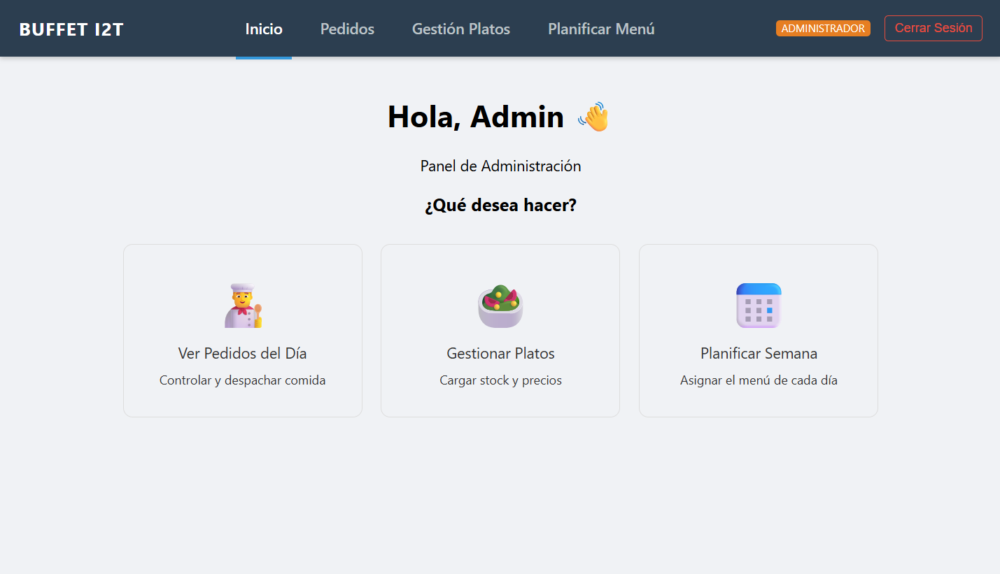
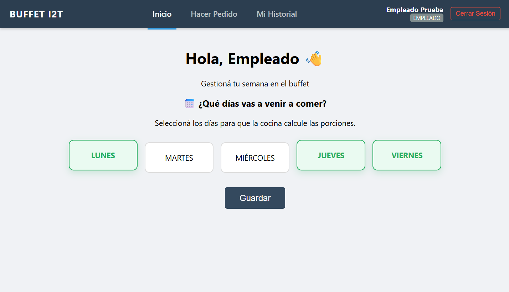

# Buffet I2T - Real-Time Food Ordering System

Full Stack web platform designed to digitalize and streamline food ordering in corporate environments.  
It enables real-time order management, weekly menu planning, and intelligent stock control through a modern web interface.

---

## 🚀 Demo

🎥 Video Walkthrough:  
https://drive.google.com/drive/folders/1nKbMZbswiXrXrOHcAHSQl7xIDWwXUu6X?usp=drive_link

> Live version coming soon

---

## ✨ Key Features

### 🧑‍🍳 Admin Panel (Kitchen / Management)
- **Weekly Menu Planner:** Assign meals from Monday to Friday with availability control.
- **Menu & Stock Management (CRUD):** Create, update, and manage dishes with dynamic pricing and quantities.
- **Real-Time Orders:** Instant order updates using WebSockets (Socket.io), eliminating manual refresh.

### 👩‍💻 Employee Panel (End Users)
- **Attendance Module:** Employees select in-office days to help forecast food demand.
- **Daily Orders:** Intuitive UI to browse menus, check stock availability, and place orders.
- **Consumption History:** Personal order tracking and history visualization.

---

## 🧠 Architecture

Decoupled client-server architecture:

- **Frontend:** Angular SPA using Standalone Components
- **Backend:** Node.js + Express REST API
- **Realtime Layer:** Socket.io (WebSockets)
- **Database:** MySQL relational model
- **Communication:** REST + bidirectional realtime updates

---

## 🛠 Tech Stack

### Frontend
- Angular (Standalone Components architecture)
- TypeScript
- HTML5 & CSS3
- Responsive dashboard UI

### Backend
- Node.js
- Express.js (REST API)
- Socket.io (real-time communication)

### Database
- MySQL relational schema
- Foreign key constraints for data integrity

---

## 📸 Screenshots

### Admin Dashboard

### User Panel

---

## ⚙️ Local Setup

### 1. Clone repository
git clone https://github.com/tu-usuario/buffet-i2t.git
2. Backend
cd backend
npm install
npm run dev
3. Frontend
cd frontend
npm install
ng serve -o
4. Database
Create a MySQL database named buffet_db

Import the provided SQL schema

Configure environment variables in .env

📈 Key Learnings
Implemented real-time communication with Socket.io to replace traditional polling.

Designed a relational database supporting weekly availability logic and stock constraints.

Built modular Angular architecture with services, guards, and global state handling.

Developed a full client-server system with real production-like workflow.

💡 Future Improvements
Authentication & role-based access

Payment integration

Docker containerization

Admin analytics dashboard

📬 Contact
🔗 LinkedIn: https://linkedin.com/victoria-de-trocchi
💼 Portfolio: https://victoriadetrocchi-portfolio.netlify.app/
📧 Email: mvictoriadetrocchi@gmail.com
